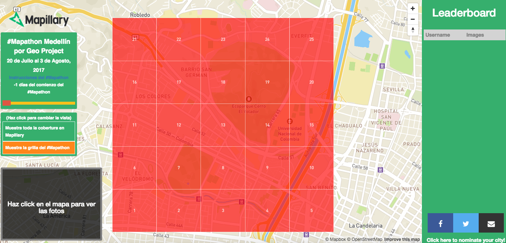

**Un reto para mapear las zonas ciclistas de Medellín y recolectar información útil para Medellín.**

Desde hoy hasta el 3 de Agosto, vamos a reunir a las comunidades interesadas en mapas, datos abiertos y colaboración en línea de Medellín para que puedan ir cubriendo las zonas alrededor de las ciclo rutas de la ciudad. Cualquier persona que viva en Medellín o que este de paso por la ciudad es bienvenido a apoyar al #Mapathon. 

La cobertura de la ciudad es bastante buena, hace tiempo que no hay nuevas coberturas en Mapillary enfocadas a las rutas ciclistas. Siguiendo el ejemplo de #CompletetheMap en Berlin que fué todo un éxito demostrando que la comunidad se puede coordinar y enfocarse en una zona especifica de la ciudad para mejorar la cobertura de fotos a nivel de calle. Estas fotos habilitarán una nueva ronda de fotos a nivel de calle con mayor detalle de información que es de interés para ciclistas. [Puedes seguir la cobertura en este tablero de aportaciones.](https://mapillary-hacks.github.io/leaderboard/medellin/).

### El #Mapathon.
Las zona de Los Colores y el Barrio de San Germán cerca de la Universidad Nacional de Colombia han sido dividas en una grilla de 5x5. Para participar en el #Mapathon, simplemente debes de capturas imágenes con la aplicación de Mapillary de las calles y las aceras de cada zona. El voluntario que contribuya el mayor número de imágenes en cada zona cuando sea marcado como completa será el ganador de dicha zona. El voluntario que tenga el mayor número de zonas ganadas será declarado el ganador de #Mapathon. Habra unos premios sorpresa para aquellos voluntarios con el mayor número de zonas.

Sí quieres tomar parte te invitamos a participar en los talleres los días **27,28,29 de Julio y el 3 de Agosto**. Para más información ir a www.datosabiertosmedellin.org, por favor confirmar su participación en la página de Meetup - https://www.meetup.com/es-ES/Datos-Abiertos-y-Gobierno-Abierto-en-Medellin/

### Las reglas.

**¿Cómo participó en el #Mapathon?**

Cualquier persona que captura imágenes dentro de la grilla automáticamente participa en el #Mapathon. No necesitas apuntarte en ningún lugar.

**La Grilla.**

Estaremos analizando la cobertura diaria de la zona e iremos asignando un color a cada zona que representara el grado de cobertura del área. Rojo significa que hay menos del 50% de cobertura, naranja que hay una cobertura por encima del 50% y verde que la zona esta completamente cubierta. Solamente las imágenes que se han capturado desde el primer día del #Mapathon van a ser contabilizadas.

**Rankings & Updates**

Vamos a mantener una página web actualizada con el ranking de los contribuyentes [aquí el link](https://mapillary-hacks.github.io/leaderboard/medellin/). Adicionalmente estaremos enviandoles un email a todos los voluntarios que vayan subiendo fotos. Puedes apuntarte [aquí](http://eepurl.com/cTGRQT). También estaremos actualizando nuestras redes sociales de [Twitter](https://twitter.com/mapillary) y [Facebook](https://www.facebook.com/mapillary) as well.

**Como ganar una zona.**

El ganador de cada zona será el voluntario que tenga el mayor número de fotos en dicha área cuando la zona sea marcada como completa (color verde). El ganador del #Mapathon será aquel que tenga el mayor número de zonas cubiertas en la grilla. El Marathon terminara cuando todas las zonas se hayan puesto en verde o hasta el 3 de Agosto cuando termina el #Mapathon.

Para mantener la competencia enfocada a beneficiar a la ciudad, nos aseguraremos que las fotos sean de uso para la comunidad de datos abiertos de Medellín. Cuando sea necesario, vamos a actualizar manualmente las zonas para que reflejen la cobertura actual del área. Estamos abiertos a recibir sus comentarios si ven que hay zonas que no se han actualizado.

**Invita a tus amigos.**

Si quieres invitar a tus vecinos, amigos o compañeros de la escuela al #Mapathon, lo único que necesitan es capturar fotos dentro de la grilla y aparecerán automáticamente en el tablero de participantes. Para mantenerse al tanto de los avances, aseguren de seguir #Mapathon en Facebook y Twitter.

**Que comience el mapeo :D**

Aseguren de cargar bien su celular y que tienen espacio para capturar imágenes, con un esfuerzo colectivo vamos a incrementar los datasets de datos abiertos de la ciudad de Medellín. Vamos al #Mapathon.

PD. Si deseas nominar tu ciudad puedes hacerlo en este link [aquí](https://drive.google.com/open?id=14X76aTo3BNVw-x_QOKx4C80pvKdny-uYdO07vggaHcQ) if you’d like to see the challenge in your neighbourhood. Si no puedes esperar y deseas montarlo por cuenta propia lo puedes hacer con el siguiente código abierto [libreria para generar una grilla y el tablero de aportaciones](https://github.com/mapillary-hacks/mapillary-hacks.github.io/tree/master/leaderboard/).
